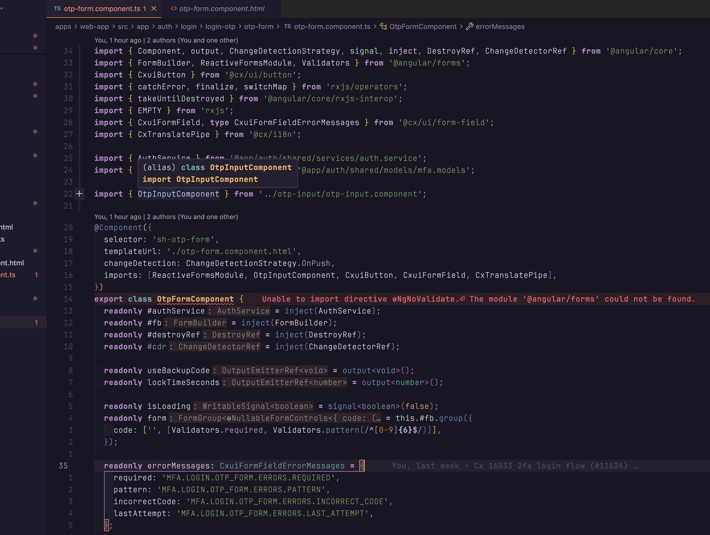
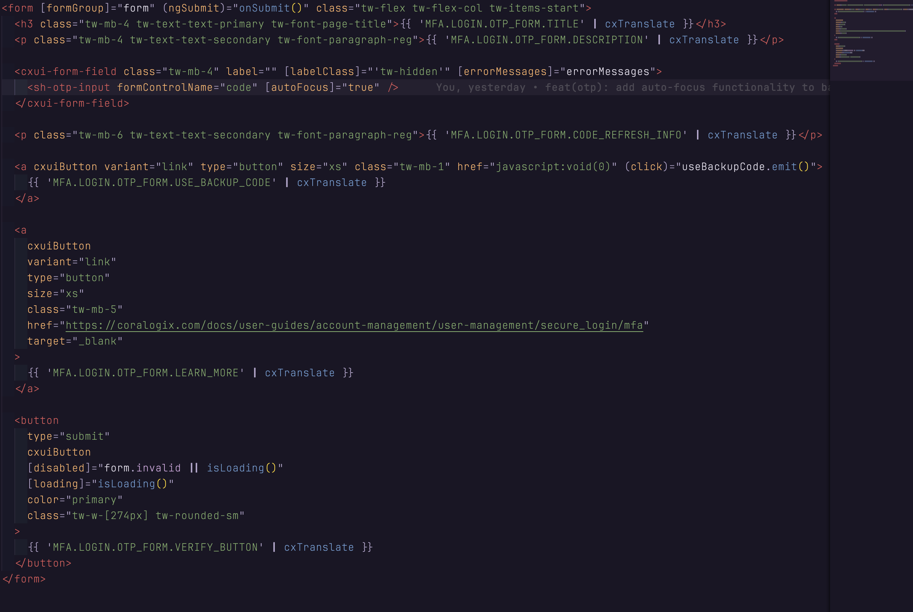
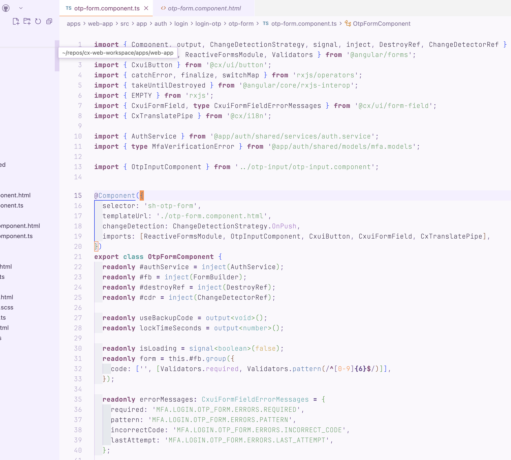
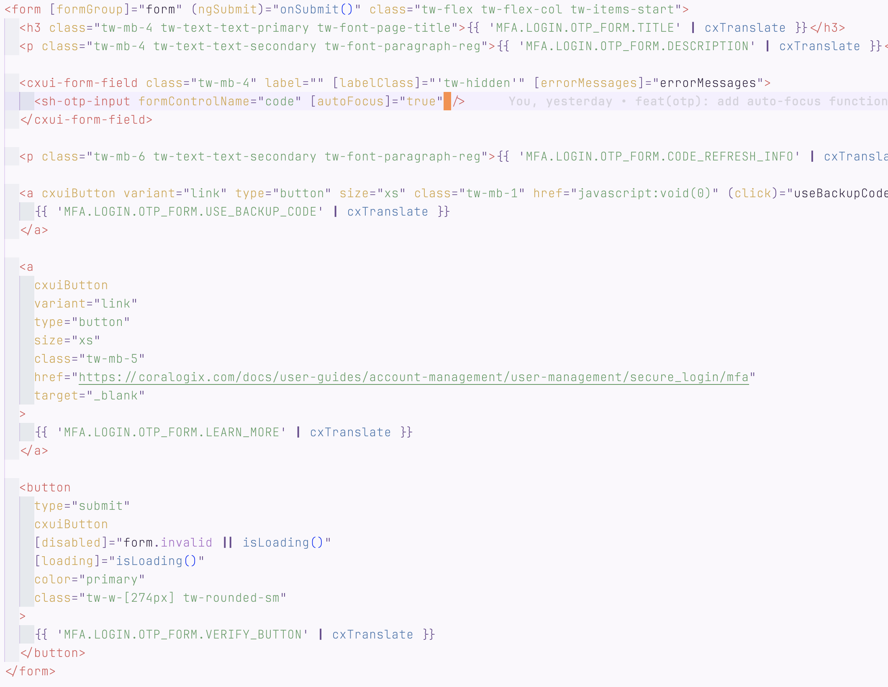

# Tbilisi Night

A beautiful dark and light theme for Visual Studio Code inspired by the warm, atmospheric nights of Tbilisi. This theme features a rich color palette with deep purples, warm oranges, and soothing blues that create a comfortable coding environment for any time of day.

## Features

- 🌙 **Dark theme** - Eye-friendly color scheme for late-night coding
- ☀️ **Light theme** - Bright and comfortable for daytime use
- 🎨 Carefully crafted syntax highlighting for both variants
- 🏙️ Warm color palette inspired by Tbilisi nights
- ✨ Optimized for readability and aesthetics

## Theme Variants

### Tbilisi Night (Dark)
Perfect for evening and night coding sessions:

- **Background**: Deep purple-black (`#1a1625`)
- **Foreground**: Soft lavender-white (`#e8e3f0`)
- **Accent**: Warm orange (`#ff8c42`)
- **Strings**: Fresh green (`#7fb069`)
- **Keywords**: Soft purple (`#b88bc7`)
- **Functions**: Sky blue (`#6b9bd1`)
- **Classes**: Warm amber (`#ffb366`)

### Tbilisi Night Light
A bright, comfortable variant for daytime coding:

- **Background**: Soft lavender-white (`#faf8fc`)
- **Foreground**: Deep purple (`#2d1f3d`)
- **Accent**: Warm orange (`#ff8c42`)
- **Strings**: Fresh green (`#5fa069`)
- **Keywords**: Rich purple (`#8b4c7a`)
- **Functions**: Sky blue (`#4b7bb1`)
- **Classes**: Warm amber (`#d4a84f`)

## Installation

### Quick Local Install (Cursor/VS Code)

**Easiest method - run the install script:**
```bash
./install-local.sh
```

Then reload Cursor and select the theme (see Usage below).

**Or manually:**
```bash
ln -s "$(pwd)" ~/.cursor/extensions/tbilisi-night
```

Then reload Cursor window (`Cmd+Shift+P` → "Developer: Reload Window").

### From VS Code Marketplace

1. Open VS Code
2. Go to Extensions (Ctrl+Shift+X / Cmd+Shift+X)
3. Search for "Tbilisi Night"
4. Click Install

### Manual Installation

1. Clone this repository
2. Open VS Code
3. Press `F1` or `Ctrl+Shift+P` (Mac: `Cmd+Shift+P`)
4. Type "Extensions: Install from VSIX..." or "Developer: Install Extension from Location..."
5. Select the extension folder

### From Source (Development Mode)

1. Clone this repository
2. Open the folder in VS Code/Cursor
3. Press `F5` to run the extension in a new Extension Development Host window
4. In the new window, go to File > Preferences > Color Theme > Tbilisi Night

For more detailed local installation instructions, see [LOCAL_INSTALL.md](./LOCAL_INSTALL.md).

## Usage

After installation:

1. Press `Ctrl+K Ctrl+T` (Mac: `Cmd+K Cmd+T`) to open the theme selector
2. Select either:
   - **"Tbilisi Night"** for the dark theme
   - **"Tbilisi Night Light"** for the light theme

Or:

1. Go to File > Preferences > Color Theme
2. Choose your preferred variant

## Screenshots

### Tbilisi Night (Dark Theme)





### Tbilisi Night Light





## Publishing to Marketplace

Want to publish this theme to the VS Code Marketplace? See [PUBLISHING.md](./PUBLISHING.md) for a complete guide.

Quick steps:
1. Install vsce: `npm install -g @vscode/vsce`
2. Create a publisher account at [marketplace.visualstudio.com](https://marketplace.visualstudio.com/manage)
3. Update `package.json` with your publisher ID and info
4. Run `./publish.sh` or `vsce publish`

## Contributing

Contributions are welcome! Please feel free to submit a Pull Request.

## License

MIT License - feel free to use this theme however you'd like!

## Credits

Inspired by the beautiful nights of Tbilisi, Georgia.

